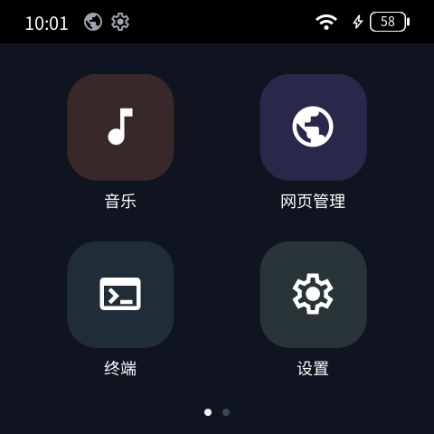
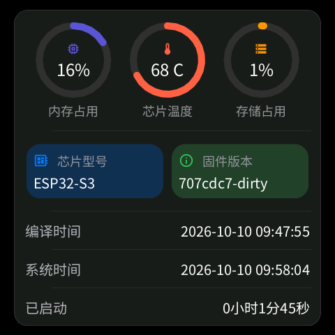
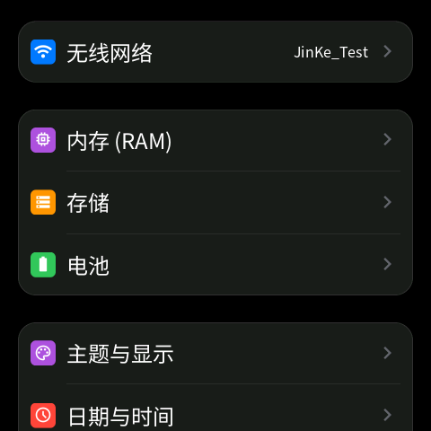
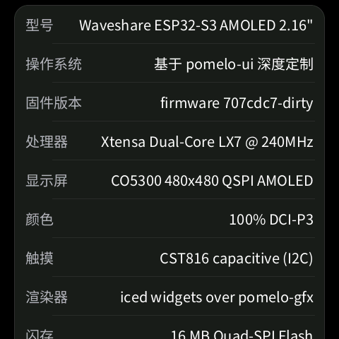
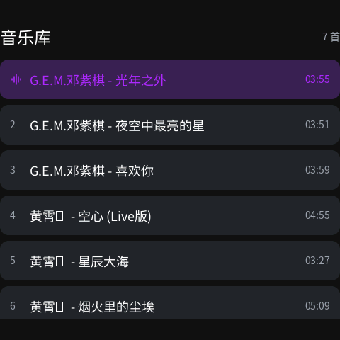
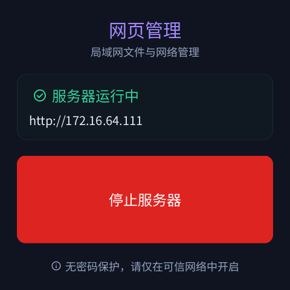
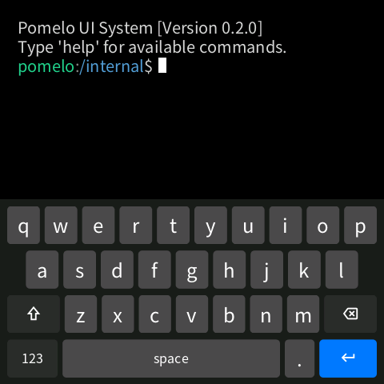
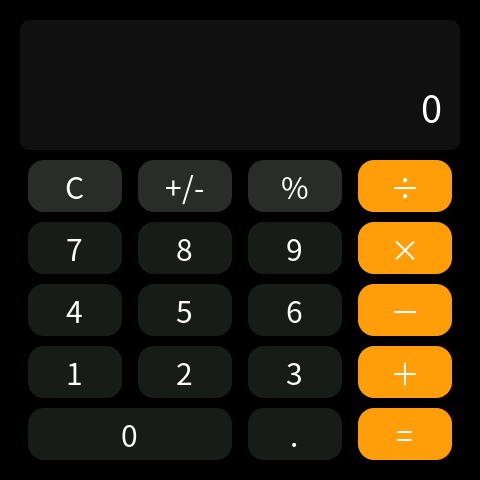

# 纯 Rust 开发的 UI 框架和 UI 系统（ESP32-S3）

**简体中文**

> 当前版本：[`v0.1.1-20261010`](https://github.com/HWYWL/HiveBox/releases/latest) —— 版本号怎么读见下方「版本号规则」

## 📖 项目简介

这个项目是为 微雪 ESP32-S3-Touch-AMOLED-2.16 触屏开发板开发的纯 Rust UI 系统。

项目基于 **ESP-IDF v6.1** 构建。  

- **测试平台**：目前固件仅在 **微雪 ESP32-S3-Touch-AMOLED-2.16** 上进行过测试。
- **可移植性**：应用与 UI 框架与硬件解耦，移植仅需适配屏幕刷新、触摸输入及 `pomelo-hal` 外设 Trait。
- **产品官方文档**：[微雪 ESP32-S3-Touch-AMOLED-2.16 文档](https://docs.waveshare.net/ESP32-S3-Touch-AMOLED-2.16)

### 基于 pomelo-ui 深度定制

本项目是 [**pomelo-ui**](https://github.com/pomelos-on-sale/pomelo-ui) 的深度定制版，两者的关系写在这里，以免读的人以为这套界面是从零写的：

- **上游 [pomelo-ui](https://github.com/pomelos-on-sale/pomelo-ui) 提供框架**：`ui-framework/` 下的 iced 移植、渲染后端（`iced-pomelo-gfx`）、软件光栅器（`pomelo-gfx`）、字体资产与烘焙工具（`pomelo-font`）、图标库（`pomelo-material-symbols`），以及它们各自的设计与文档。
- **本项目在框架之上做定制**：板级固件与板级驱动（`pomelo-firmware/`）、外设抽象与模拟后端（`pomelo-hal/`）、应用（`pomelo-apps/`）、应用共享控件（`pomelo-widgets/`），以及界面本身 —— 具体每一条见下方「版本时间线」。
- **上游的名字与目录都保留**：`ui-framework/` 的结构、各组件的 `README.md` 与 `LICENSE`、`pomelo-*` 的命名照旧，便于与上游逐项对照。上游组件按需做最小的修改（例如字体子集补字），这类改动同样在这里可见。

---

## 📷 界面预览

下面都是**真机屏幕**（480×480 AMOLED）的实拍，不是设计稿：

| 桌面 | 设置 · 读数面板 | 设置 · 主列表 | 设置 · 系统信息 |
| :---: | :---: | :---: | :---: |
|  |  |  |  |
| 状态栏、四个应用与分页点 | 三个环 + 芯片与固件卡，页脚是编译/系统时间与已启动 | 无线网络、内存、存储、电池、主题、日期与时间 | 规格与读数分开：操作系统一栏说明来源，固件版本是镜像自报 |

| 音乐播放器 | 网页管理 | 终端 | 计算器 |
| :---: | :---: | :---: | :---: |
|  |  |  |  |
| 读 TF 卡里的音乐，列表点击播放，进度与音量可直接拖动 | 板子自己起 HTTP 服务，同一网络里用浏览器打开 | 触屏键盘输入，板内命令行 | 用 iced 自带控件写的计算器 |

---

## 🚀 快速上手

### 1. 拿到代码

```bash
git clone https://github.com/HWYWL/HiveBox.git
cd HiveBox
```

上游框架组件（`ui-framework/`）在本仓库里是普通目录，会跟着主仓库一起下来，不需要 `--recurse-submodules`。上游项目本身见 [pomelo-ui](https://github.com/pomelos-on-sale/pomelo-ui)。

### 2. 在 PC 上跑起来（不需要板子）

```bash
cd pomelo-apps
cargo run -p app-launcher   # 整机界面：桌面、状态栏、应用切换
cargo run -p calculator     # 单个应用
```

Q 键为返回键，W 键为退出键。读数来自桌面模拟后端（`pomelo-hal/src/sim/`），所以不接板子也能看到完整界面。

### 3. 刷到板子上

板子：**微雪 ESP32-S3-Touch-AMOLED-2.16**。

#### 3.1 直接刷现成固件（推荐：不用装 ESP-IDF 和 Rust 工具链）

到 [**Releases**](https://github.com/HWYWL/HiveBox/releases/latest) 下载 `hivebox-firmware-*.bin`，用 USB 连上板子，然后：

```bash
pip install esptool
esptool --chip esp32s3 --port COM3 --baud 921600 write_flash 0x0 hivebox-firmware-<版本>.bin
```

- **烧到 `0x0`**：这个 `.bin` 是**合并镜像**（bootloader + 分区表 + 应用），一条命令写完，不用管偏移。
- **不会抹掉已有数据**：镜像只覆盖 `0x0` 到约 `0xAC0000`，而 Wi-Fi 凭据与音乐设置存在 `0xC10000` 的数据分区上，刷完还在。想回到出厂状态，先 `esptool --chip esp32s3 --port COM3 erase_flash`，再刷一次。
- `--port` 换成你自己的串口：Windows 是 `COM3` 这类（设备管理器 → 端口），Linux 是 `/dev/ttyACM0`，macOS 是 `/dev/tty.usbmodem*`。
- 正常情况下 esptool 会用 DTR/RTS 自动让板子进下载模式；连不上时按住 **BOOT** 键再插 USB。

#### 3.2 从源码编译烧录（改代码时用）

先装工具链：

- **ESP-IDF v6.1**（或兼容版本）
- **Rust Xtensa 工具链**：`cargo install espup && espup install`

然后是：

```bash
cd pomelo-firmware/firmware

./flash.sh          # Linux/macOS：默认串口 /dev/ttyACM0，结尾会进 monitor（Ctrl+] 退出）
./flash.sh COM3     # Windows：把串口当第一个参数传进去
```

`flash.sh` 在找不到 `idf.py` 时会去 source `$IDF_PATH`（默认 `~/.espressif/v6.1/esp-idf`）的 export 脚本；ESP-IDF 装在别处就先 `export IDF_PATH=...`。不想用脚本也可以直接：

```bash
idf.py -p COM3 flash monitor   # 编译 + 烧录 + 串口日志
idf.py -p COM3 app-flash       # 只写应用区（0x10000），日常改代码够用
```

### 4. 第一次开机

按下 **PWR** 键开机。开机后进入桌面，左右滑动翻页，点击应用图标打开应用，左按钮最小化应用，右按钮退出应用，中键长按关机。

---

## ✨ 功能与硬件支持

### 1. UI 框架与图形特性

| 特性 | 状态 | 说明 |
| :--- | :---: | :--- |
| **Iced 组件** | ✅ 已支持 | 按钮、滑块、Canvas 自定义画布、布局容器等 |
| **中文字体** | ✅ 已支持 | 思源黑体烘焙子集，离线位图蒙版，零矢量排版开销 |
| **系统图标** | ✅ 已支持 | Material Symbols 图标字体封装，强类型 `const` 常量 |
| **软件光栅化** | ✅ 已支持 | 纯 Rust RGB565 引擎（`pomelo-gfx`），原生直写 16 位帧缓冲 |
| **脏区呈现** | ✅ 已支持 | 局部损坏区域追踪（Damage Tracking），静态界面 0 重绘 |
| **PC 端运行** | ✅ 已支持 | 桌面窗口模拟运行与调试（Q 返回，W 退出） |

### 2. 硬件封装与 UI 接入

> 底层驱动由 ESP-IDF 提供，本项目负责封装为 Rust `pomelo-hal` Trait 并接入 UI 呈现与交互。

| 模块 | 状态 | 说明 |
| :--- | :---: | :--- |
| **屏幕** | ✅ 已接入 | 脏区局部刷新，DMA 切片传输 |
| **触摸** | ✅ 已接入 | 点击、滑动交互，系统统一事件队列驱动 |
| **Wi-Fi** | ✅ 已接入 | 热点异步扫描与连接，状态栏/设置页显示 IP 与信号强度 |
| **电池** | ✅ 已接入 | 实时电量百分比、电压监测、充电状态与电源键事件 |
| **音频** | ✅ 已接入 | I2S PCM 流式播放，支持音量调节 |
| **按键** | ✅ 已接入 | 物理按键捕获，支持桌面翻页、退出应用与关机 |
| **RTC 时钟** | ✅ 已接入 | 关机继续走时，自动同步 RTC 时钟与 POSIX 时钟 |
| **IMU 传感器** | 🚧 待接入 | HAL Trait 及模拟器就绪，硬件驱动待接入 |
| **麦克风** | 🚧 待接入 | 音频采集接口与录音待开发 |
| **TF 卡** | ✅ 已接入 | SDMMC 1-bit 挂载 FATFS，设置页显示容量、已用与剩余空间 |
| **蓝牙** | 🚧 待接入 | 硬件具备，协议栈暂未启用 |

---

## 🏷️ 版本号规则

版本号形如 `v0.1.1-20261010`：

| 位置 | 含义 | 什么时候 +1 |
| :--- | :--- | :--- |
| 第一位 `0` | 大版本 | 重大更新，**慎之又慎**：换架构、换上游基线、破坏兼容的量级才动 |
| 第二位 `1` | 功能版本 | 新增了功能 |
| 第三位 `1` | 修复版本 | 修 bug、补漏洞、优化实现或文档 |
| `-` 之后 | 构建日期 | `YYYYMMDD`，这一版固件编译的日子 |

**设置里的「固件版本」就是这个 tag。** 镜像的版本号取自 `git describe`（ESP-IDF 的默认行为，本项目没有另外指定）：在打过 tag 的提交上构建出来的固件，版本就是 tag 名；在 tag 之后又提交了几次再编译，`git describe` 会在后面缀上「距离该 tag 有几个提交」和提交短哈希，形如 `v0.1.1-20261010-3-g16414fb`，工作区有未提交改动时还会再带一个 `-dirty`。

**界面上只显示版本号**（`v0.1.1-20261010`）。中间那段提交信息属于*构建*，不属于版本：它留在启动日志和网页管理页里给开发看，而界面这一行旁边就是「编译时间」，已经回答了「这是什么时候编的」。`-dirty` 保留 —— 它不是「离 tag 多远」，而是「这份代码根本不是 tag 那份」，藏掉它等于替一个没人发布的镜像自称版本。想让自己编译的固件也显示成版本号，就在要发布的那次提交上打个 `v*` 的 tag。

发布是自动的：[`.github/workflows/release-firmware.yml`](.github/workflows/release-firmware.yml) 在推 `v*` tag 时编译固件、生成合并镜像、把 `docs/releases/<tag>.md` 当发行说明挂到 Releases；它还会核对「镜像自报的版本 == tag」，不一致就让构建失败。

---

## 🕒 版本时间线

本项目按日期记录。每条是从 `git log` 里挑出来的一句话——「改了哪一页、哪条读数」这类细节以提交信息为准，这里只留对人有用的一行。新的一天加在最上面；每次发布在 [**Releases**](https://github.com/HWYWL/HiveBox/releases) 里留一版带 tag 的固件（刷法见「快速上手」3.1，版本号读法见上一节）。

> 维护方式：改完一批东西，在最上面那一天的列表里加一行；跨天的改动另起一个日期。写「做了什么、对用的人意味着什么」，不写「改了哪个文件」。

### 2026-10-10

- **电池改为自己画**：电量数字写进电池形状里面，不再跟在数字后面的那个 `%`；充电改用一支闪电，不再借绿色电池表示「正在充电」。
- **顶边下拉的后台面板**：从屏幕顶边往下拉，列出正在运行的应用（最近用过的排在前面），每张卡右侧一个 ⊗ 可以单个结束，标题栏右侧可以一次全部清除。它是盖在桌面上的一层，收起时不会结束任何应用。
- **固件版本带上编译时间**：读数面板的页脚多了「编译时间」，和「系统时间」「已启动」排在一起——三条都来自镜像自己，从编译到开机到现在。
- **系统信息的操作系统行**改为一句话说明来源：基于 pomelo-ui 深度定制；镜像自己的名字与版本移到了同一页的「固件版本」行。
- **网页管理页的「浏」不再是方框**：字体子集补入该字并重烘字形表，页面上「启动后即可在浏览器中打开」整句可以正常显示。
- **首次对外发布**：README 换成自己的仓库地址、补上真机预览图与「下载后怎么刷」的说明；固件以合并镜像的形式挂到 Releases，一条 `esptool` 命令即可刷进板子。
- **发布流程自动化**（`v0.1.1-20261010`）：新增 GitHub Actions —— 推一个 `v*` 的 tag，CI 就用 ESP-IDF v6.1 与 Xtensa 工具链编译、生成合并镜像、把 `docs/releases/<tag>.md` 当发行说明挂到 Releases，并核对「镜像自报的版本 == tag」，不一致直接构建失败。README 补上「版本号规则」，同时去掉一个指向不存在文件的英文 README 链接。本版没有固件功能改动，属于修复与流程优化，所以只动第三位。

- **应用进出有了过渡动画**：点图标打开从右侧滑入，返回键或左边缘返回向右滑出，底部上滑回桌面向上滑出 —— 240 ms、`EaseOutCubic`，与翻页同一套手感。滑动期间应用画在桌面之上，而屏幕本身在「手势决定」的那一帧就切换，所以状态栏、后台列表与退出键的行为一点没变：动的只是画面。
- **固件版本只显示版本号**：读数面板的固件卡与系统信息页原来显示一整串 `v0.1.1-20261010-3-g16414fb`，现在只显示 `v0.1.1-20261010`（也就是它基于的那个发布），旁边的「编译时间」回答「这是什么时候编的」。`-dirty` 仍然显示，因为那表示这份代码不是 tag 那份；启动日志与网页管理页里的完整版本串不变。
- **返回与回桌面改成「跟手」**：从左边缘往右拖、从底部往上拖，应用跟着手指走；拖到一半松手时，按「够远或够快」决定它走还是回来 —— 够远约屏幕的三分之一，够快是 450 px/s（和翻页同一个速度阈值）。拖动期间不误伤列表滚动：只有从边缘那一圈开始的拖动才会被认领，页面中间的拖动仍然是页面的。
- **后台面板也跟着手**：从顶边往下拖，面板跟着手指下来；往回推它就回去，甩一下则判定 —— 判定与返回/回桌面共用同一套（够远 35%、够快 450 px/s）。面板已经打开时，从底部往上拖同样能把它推回去。点遮罩或按返回键收起面板也变成滑动，不再"啪"地消失。
- **手势变得好触发了**：判定门槛回到改造前的水平 —— 拖过屏幕 **96 px**（原先跟手版本要 168 px）或甩到 **250 px/s**（原先要 450 px/s）就算数。另外手势改按「手指从哪条边落下」判定，不再按起手那十几像素的方向：拇指从底边往上滑时带一点侧向弧线，以前会认不出来，现在照旧算「回桌面」。
- **边缘带从 24 px 放宽到 48 px**：这是手指**落点**必须在其中的范围。480 px 对应约 39 mm，所以 24 px 只有 1.9 mm —— 比指尖的接触面还窄，得刻意瞄准才落得进去，手势自然「难滑」。48 px 不到 4 mm，接近手机的边缘带。判定距离同时改为按「手指走过的距离」算（把起拖那 18 px 补回来），于是「一次 96 px 左右的滑动」和改造前一样好用。
- **新应用「任务查看器」**（桌面第二页）：一眼 `htop` —— 顶部两条内存计量条（内建堆与 PSRAM），下面一张任务表，列出调度器正在跑的每个任务的**状态、优先级、剩余栈、所在核心**，正在画这张表的那一行带 `*`；每秒刷新一次。数据全部来自板子：`uxTaskGetSystemState` 读任务（为此在 `sdkconfig.defaults` 里打开 `CONFIG_FREERTOS_USE_TRACE_FACILITY`），PSRAM 是新加的一项独立读数（不与内建堆相加 —— 那两个池子混在一起会让「堆快满了」看起来像「还剩三分之二」）。

### 2026-10-09

- 设置页顶部新增**系统信息读数**：内存占用、芯片温度、存储占用三个环，芯片型号与固件版本两张卡，以及时间与运行时长。
- 系统信息页的固件行改为读**镜像自报**的名字与版本，不再写字面量（此前写的是 `Pomelo OS v0.2.0 (Build 2026.09)`，一个并不存在的镜像）。
- 桌面只留五个应用，删掉示例应用并重排两页。
- 音乐播放器：进度条与音量条可以直接拖动；列表点击才播放；音量与 Wi-Fi 一样记住。
- 网页管理端：板级 HTTP 服务（网络自检、遥控触控、日志、试听喇叭）与配套的 `web-manager` 应用（文件/网络/设备三页签）。
- 列表轻触不再被误判为滚动（新增 18px 触控阈值），行内按钮恢复可点。
- 字体子集补入「渲」，设置页「渲染器」不再画成方框；修复画布：开放路径不再被强行闭合（圆环曾被画成楔形）。

### 2026-10-08

- **起点**：以上游 [pomelo-ui](https://github.com/pomelos-on-sale/pomelo-ui) 提供的框架为基础，导入完整的 Rust ESP32-S3 UI 工程（`ui-framework/` 保留上游全部组件）。
- Wi-Fi 凭据改为经 C 侧真正落盘，无线开机默认开启，烧录不再覆盖数据分区。
- 手机式边缘手势：底部上滑回桌面，左右边缘滑动返回上一页。
- 设置页新增重启；电池页温度改为真实 PMIC 读数。
- 存储页展示整块 16 MB 闪存与分区；修复按钮点击后的残留高亮。

---

## 🎨 iced 框架移植（`ui-framework/`）

> 这一层来自上游 **pomelo-ui**，本项目按需做最小的改动（例如字体子集的补字）。改动同样记录在上面时间线的日期里。


- **`ui-framework/iced`**：针对嵌入式环境定制的 iced 分支，移除了 Xtensa 架构不支持的 64 位原子操作与 `mmap` 系统依赖。
- **`ui-framework/iced-pomelo-winit`**（包名 `iced_winit`）：嵌入式平台适配层，负责事件循环派发、RGB565 帧缓冲呈现、脏区追踪以及字体加载。
- **`ui-framework/iced-pomelo-gfx`**：iced 渲染后端实现，负责将应用界面的绘制命令录制为渲染批次供平台层回放。
- **`ui-framework/pomelo-gfx`**：面向 16 位色彩原生面板的高性能纯 Rust 软件光栅化引擎，支持几何图形、抗锯齿描边与字形蒙版绘制。
- **`ui-framework/pomelo-font`**：嵌入式字体工具链与资产，提供中文字体子集化及预烘焙位图字形表。
- **`ui-framework/pomelo-material-symbols`**：Google Material Symbols 图标字体库封装，提供类型安全的图标常量定义与字形映射。


---

## 🙌 欢迎发起 Issue 和提交 Pull Request

欢迎为本项目贡献代码、扩充组件、优化性能或修复问题。提交步骤：

- 创建 Issue 描述问题或计划添加的新特性
- Fork 仓库并创建新分支
- 本地开发与测试（用项目自己的测试套件：`cd pomelo-apps && cargo test --workspace`）
- 提交 Pull Request 并关联对应 Issue

---

## 🤖 AI 编写声明

本项目所有代码（底层驱动、UI 框架与应用程序）全部由 **AI 编写生成**。受限于生成机制与验证深度，代码质量可能存在以下问题：

- **功能不全与边界异常**：部分功能实现可能不够完备，在边界情况或非预期输入下可能表现异常。
- **潜在 Bug 与稳定性隐患**：缺少系统性的自动化测试覆盖，可能潜藏未被发现的逻辑缺陷或崩溃风险。
- **性能与资源开销未调优**：代码未做深度的性能分析与优化，可能存在内存浪费或运行效率低下的问题。
- **可读性与可维护性不足**：多轮增量生成缺乏顶层长远规划，可能存在架构松散、逻辑冗余及规范不统一的问题。

> **免责声明**：本项目仅作为实验与技术探索，请自行承担用于生产环境的风险和后果。

---

